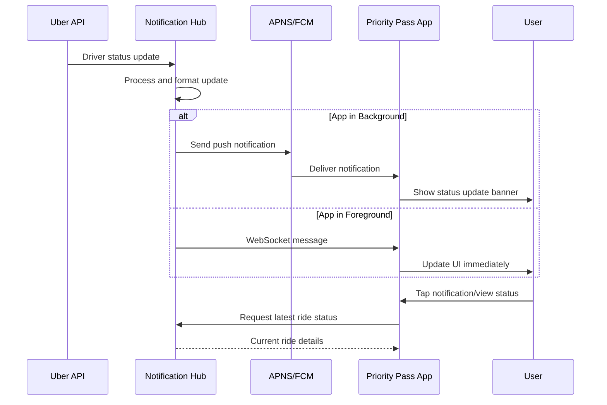

# Real-Time Notification Implementation for Priority Pass Taxi Integration

## Overview

This document outlines the protocol and mechanisms for delivering real-time ride status updates from the Notification Service to the Priority Pass mobile application.

## Protocol Options for Real-Time Updates

### 1. **Push Notifications (Recommended)**
- **iOS**: Apple Push Notification Service (APNS)
- **Android**: Firebase Cloud Messaging (FCM)
- **Mechanism**: Server-to-device push via platform-specific services
- **Latency**: ~1-3 seconds
- **Reliability**: High, with fallback handling

### 2. **WebSocket Connections**
- **Protocol**: WSS (WebSocket Secure)
- **Mechanism**: Persistent bidirectional connection
- **Latency**: Real-time (<1 second)
- **Battery Impact**: Higher due to persistent connection

### 3. **Server-Sent Events (SSE)**
- **Protocol**: HTTP-based event stream
- **Mechanism**: One-way server-to-client streaming
- **Use Case**: When app is active/foreground

## Recommended Implementation

**Hybrid Approach**: Push Notifications + WebSocket failover



## Implementation Details

### Push Notification Payload

```json
{
  "notification": {
    "title": "Ride Update",
    "body": "Your driver is 5 minutes away"
  },
  "data": {
    "ride_id": "abc123",
    "status": "driver_approaching",
    "eta": "5 minutes",
    "driver_name": "John",
    "vehicle": "Toyota Camry - ABC123"
  }
}
```

### WebSocket Message Format

```json
{
  "type": "ride_status_update",
  "ride_id": "abc123",
  "status": "driver_approaching",
  "timestamp": "2024-01-20T14:30:00Z",
  "data": {
    "eta": 300,
    "driver_location": {"lat": 51.5074, "lng": -0.1278}
  }
}
```

## Benefits of Hybrid Approach

- **Reliability**: Push notifications ensure delivery even when app is backgrounded
- **Real-time responsiveness**: WebSocket provides immediate updates when app is active
- **Battery optimization**: Avoids persistent connections when not needed
- **Fallback mechanism**: Multiple delivery channels ensure message receipt
- **Platform compatibility**: Works across iOS and Android using native services

## Technical Considerations

### Security
- All WebSocket connections use WSS (secure WebSocket)
- Push notification tokens are encrypted and rotated regularly
- Message payloads contain minimal sensitive data

### Scalability
- Notification Hub can handle multiple concurrent ride updates
- Push notification services handle millions of devices
- WebSocket connections are managed per active session

### Error Handling
- Retry logic for failed push notifications
- WebSocket reconnection on connection loss
- Graceful degradation to polling if real-time fails